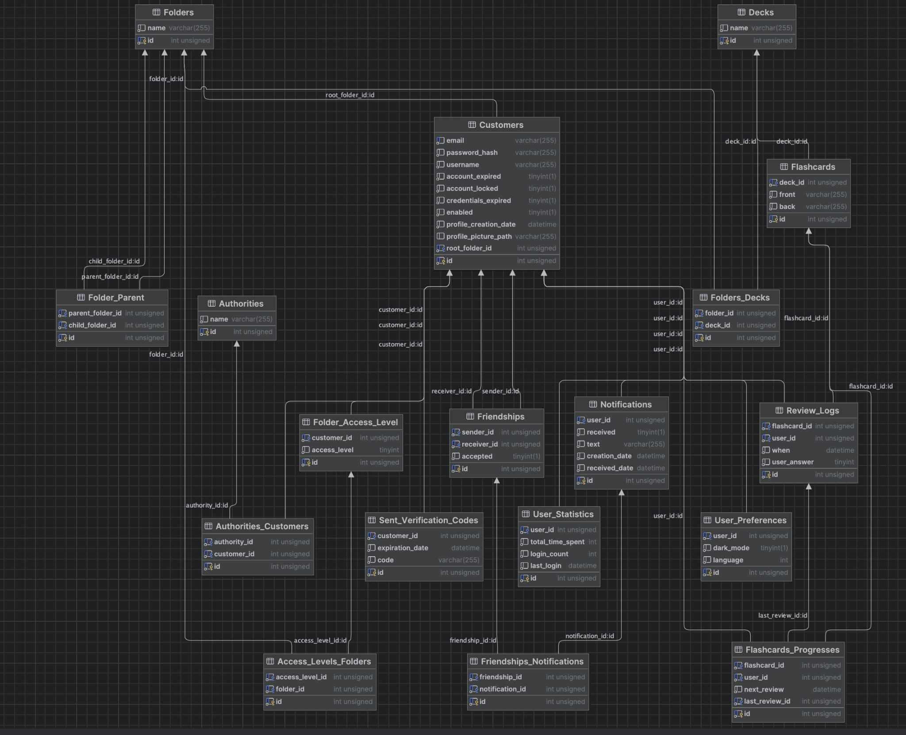
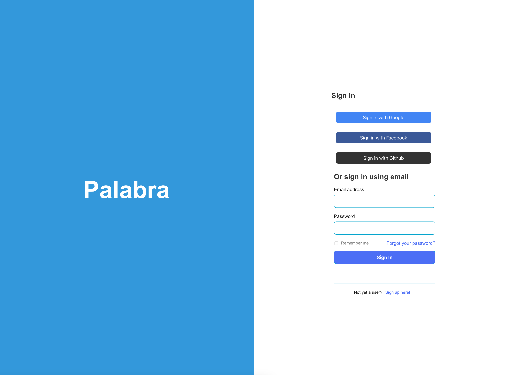
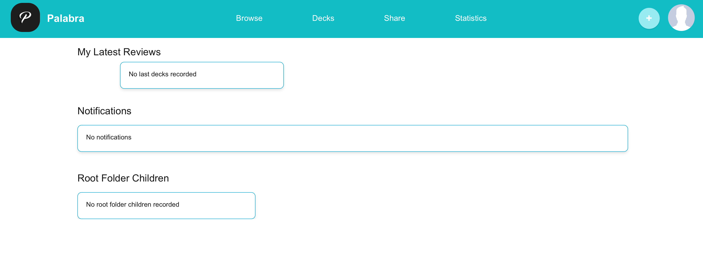
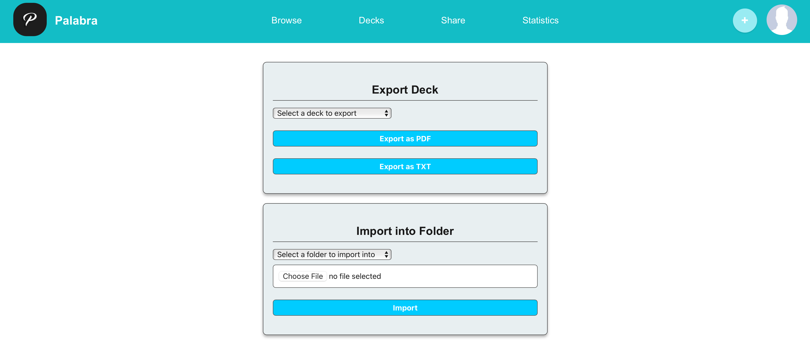
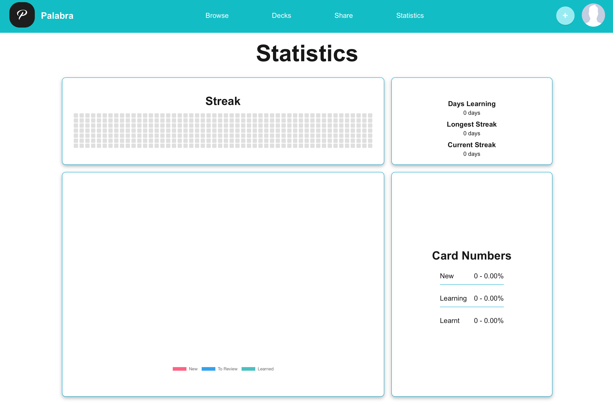

# Project Topic: Web Application for Learning with Flashcards

### Inspirations
- Anki
- Quizlet

### Architecture
According to the project requirements, we will use a three-tier architecture where the database is separated from the business logic and the user interface.

### Database Structure

### Team
- Julia Czosnek
- Kacper Górski
- Marcin Polewski
- Maciej Cieślik

### Technologies
- **Spring** – backend, database management
- **React** – frontend
- **Node.js** – handling certain processes, API
- **Docker** – application containerization
- **Git** – version control and team collaboration

### Application Features

1. **Login and Registration**
   - Login with email and password
   - Registration via email
   - Password recovery
   - OAuth login

2. **Flashcard Creation**
   - Creating folders for flashcards
   - Modifying and deleting flashcards
   - Study modes: Classic flashcards
   - Importing and exporting flashcards

3. **Spaced Repetition Algorithm**
   - Implemented as a service that schedules flashcard appearances based on the "spaced repetition" method

4. **Statistics**
   - Tracking user progress
   - User statistics, such as:
     - Number of flashcards reviewed per day
     - Number of flashcards due for review

5. **Flashcard Management**
   - Swapping the front and back of a flashcard
   - Storing data in the database

### Additional Features

- Notifications – sent via email
- Flashcard sharing – allows sharing with other users

### Result
Login screen:

Main screen:

Import/export screen:

Statistics screen:

### Future Ideas
- User rankings

### Useful Commands
- `docker compose down -v --rmi all` stops containers, removes memory and images
- `docker compose up` starts the application
